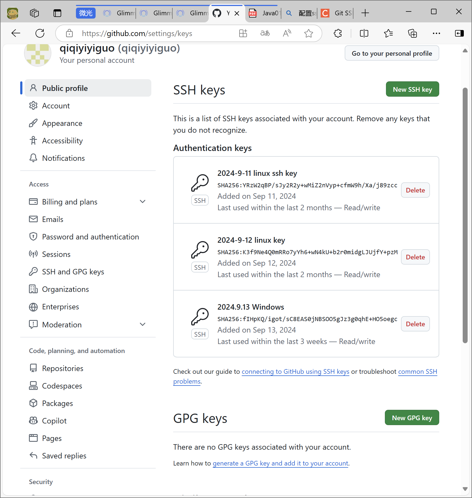
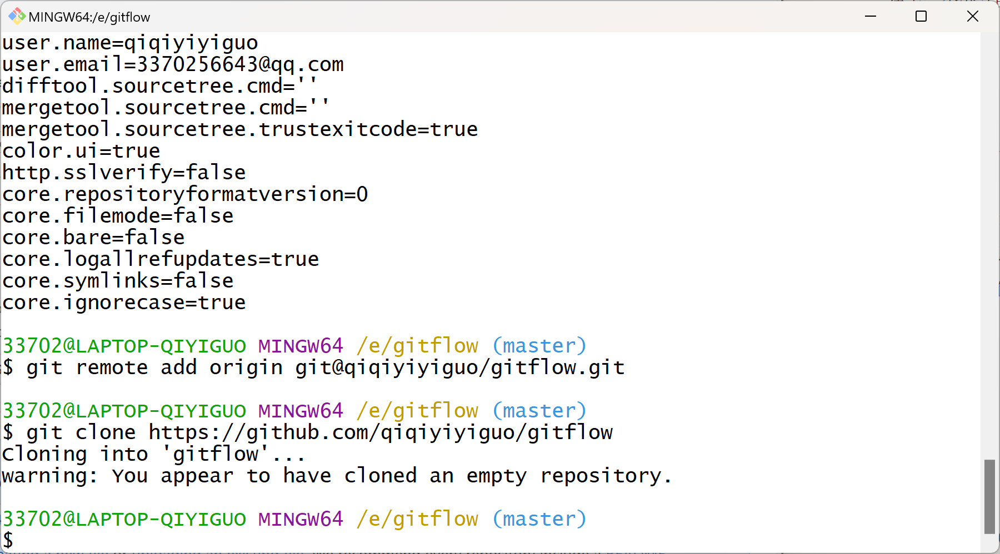
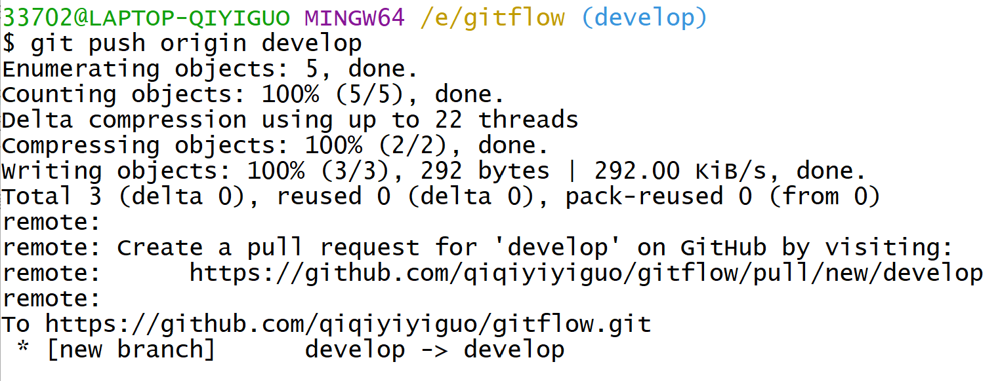
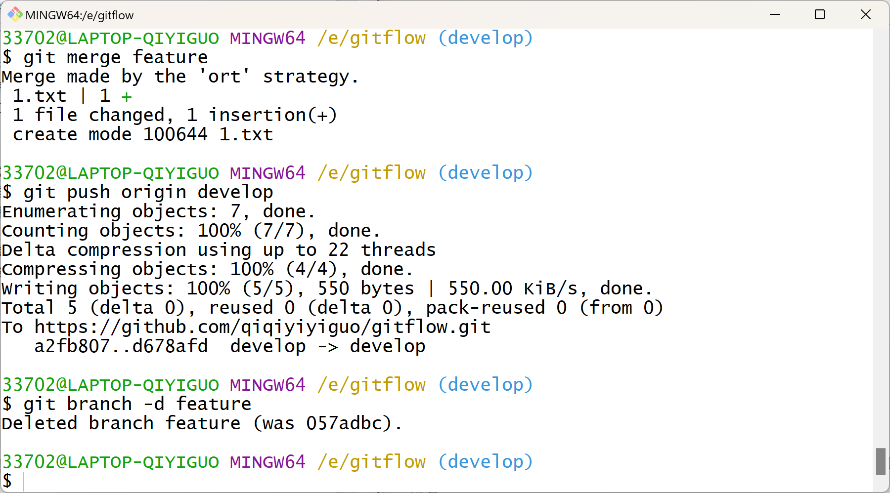
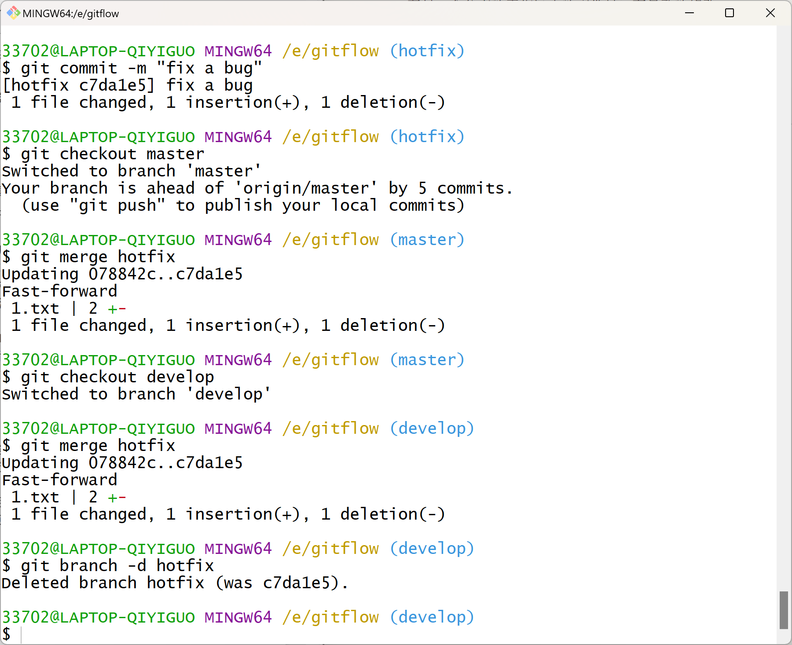
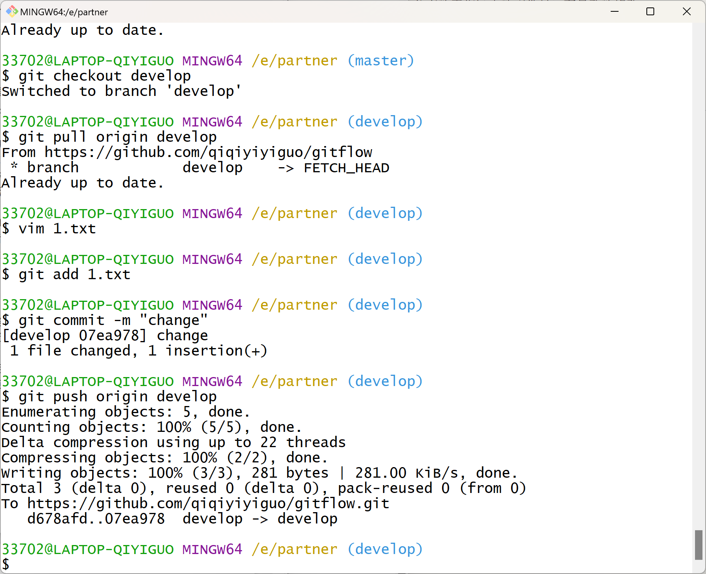
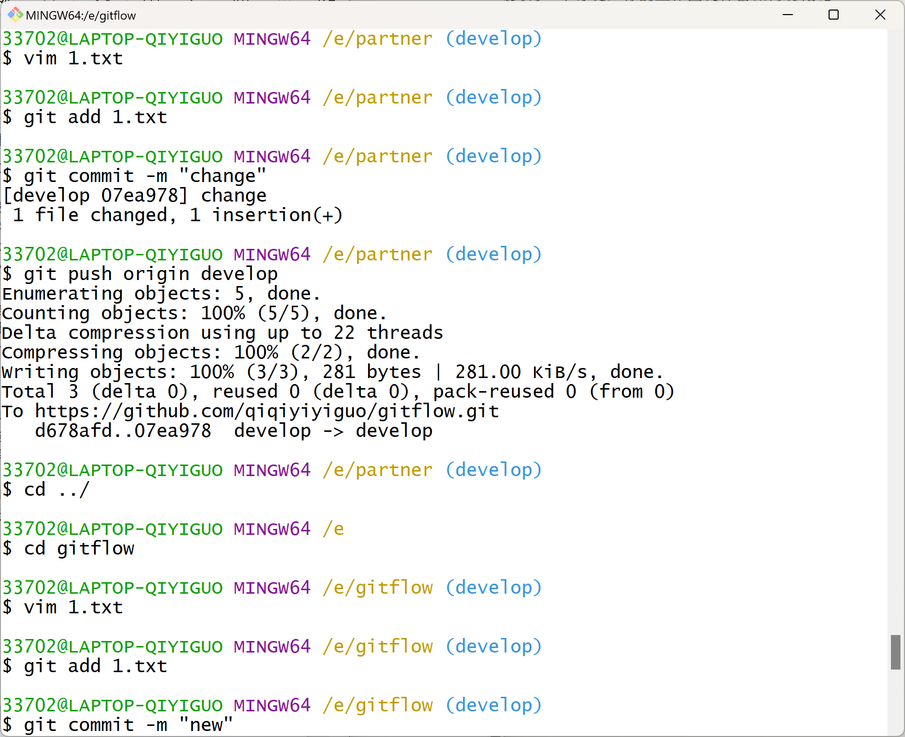
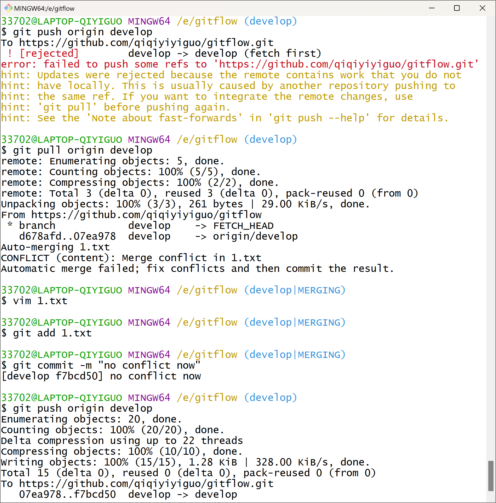

# TASK5

1. .git/目录是什么？

   该目录包含让git能够正常工作所需的所有信息

2. .git目录里放了什么？

```bash
E:\GLIMMER\.GIT
│  COMMIT_EDITMSG：保存最后一次的提交信息
│  config：仓库配置（远程URL、邮箱、用户名等）
│  description：仓库的描述信息
│  HEAD：HEAD指针，指向当前分支
│  index：暂存区
│
├─hooks（钩子）：git提供的shell脚本（一种控制软件应用程序的可执行文件），用以在有意义的git阶段自动运行，脚本名就是执行时机
│      applypatch-msg.sample
│      commit-msg.sample
│      fsmonitor-watchman.sample
│      post-update.sample
│      pre-applypatch.sample
│      pre-commit.sample
│      pre-merge-commit.sample
│      pre-push.sample
│      pre-rebase.sample
│      pre-receive.sample
│      prepare-commit-msg.sample
│      push-to-checkout.sample
│      sendemail-validate.sample
│      update.sample
│
├─info：包含git仓库的一些信息
│      exclude：记录本地仓库的文件忽略规则
│
├─logs：保存所有更新的引用记录
│  │  HEAD：保存所有操作记录（git reflog命令的查询结果来源）
│  │
│  └─refs
│      ├─heads：存储本地分支对象
│      │      master：本地的一个分支名
│      │
│      └─remotes：远程的所有分支对象
│          └─origin
│                  master
│
├─objects：存放所有的git对象
│  ├─07
│  │      e9c1ffc508395166052180a4d858ba3b9fee9f：哈希值，共40位；前2位：文件名称；后38位：对象文件名
│  │
│  ├─09
│  │      6e5653ef09edc0e226b1be4c18025ca2c07ad4
│  │
│  ├─0c
│  │      336e27bf893dab9b5e7ed54b7a4eb98f0719b5
│  │      39d15afe0e8f1e06a45a6913c2e057529b4af7
│  │
│  ├─0d
│  │      8917fadffaa990b9f8c8804bae57cc55089952
│  │
│  ├─12
│  │      1f0330949e3276666a576bd9f5426d8be884fe
│  │      d2d5ad4e93e1538a3964d58d0931cc618a222e
│  │
│  ├─15
│  │      8aea282a059b594334d2f10a68703b462ef113
│  │
│  ├─16
│  │      27396f47c68d38470d0bf2033c7f92f63ce7f2
│  │      3f298c6d475bb01403bcd833cf8d97cb5022a6
│  │
│  ├─1a
│  │      08e11b70a505ea2fe026b8a6129444628f9f4a
│  │
│  ├─21
│  │      144023407afe5babd1bac0b76803ac0268d556
│  │
│  ├─23
│  │      d92b6d0d39c2d36a837033bd6b4a6d8517514d
│  │
│  ├─26
│  │      4740846b3cbc6aeed1ec3cda619b194fe04601
│  │
│  ├─2d
│  │      dde181a09f5bdaf2788ccc7573572d22f70f3c
│  │
│  ├─2e
│  │      42215244f7606be41e7229c350e33e6819ec94
│  │
│  ├─35
│  │      6210ec7eab287daf4190bbb75a1023d0416592
│  │
│  ├─3b
│  │      7d63c50ae370afd07e3f00433e0ed71038fc49
│  │
│  ├─3f
│  │      4a7f7846c4fc979e3bcb65857f3fa1c1a613d7
│  │      4af49adfb56edc42f31cb3329cf2dea8064ab7
│  │      fbf2885d3d24b7ecb3421f30ecc80d76514bfa
│  │
│  ├─40
│  │      91023df8d4116a3b736fd915f73f162c7235c1
│  │
│  ├─43
│  │      8d2411424f9f8d7f63c58f7c45a6c0efe120e5
│  │
│  ├─44
│  │      7f25aae6d50bf72b6aedd980dbd2640ab97f7c
│  │
│  ├─47
│  │      63820b167ff05797997a4ed50fb16fd4e52ccb
│  │
│  ├─49
│  │      2a6c3572ceb1bac8631c6ffed937e41604a0d0
│  │
│  ├─4a
│  │      687e69329aa096e45f7e63c463682e843cf36a
│  │
│  ├─4b
│  │      ddd2cf0cf0edb965d8b1d8013397877555f3e3
│  │
│  ├─51
│  │      351cd0b11d99f66cfc95ddc5b6803402e2279c
│  │      7d36a8b9f02c07d97323bafa46fb2a3b68e119
│  │
│  ├─52
│  │      562eb729c02a270348791f98c6a61e1db435c7
│  │      e16e39a4f4fed7c150d884aaf876c23ef2e338
│  │      f1b196dd25953fd547a452603de8b3216d27b8
│  │
│  ├─56
│  │      5070e31fb951006523e4f48dc6c9b535687135
│  │
│  ├─5a
│  │      405a37c317c80bfc32b82703f46494335c89b9
│  │
│  ├─5b
│  │      3ccd7e7b845d14d2fc39a8d56e9359d449a7a4
│  │
│  ├─5c
│  │      af6f5fe9c80caa9a5664614bfcacfaf2e12afb
│  │
│  ├─5d
│  │      612348361841ef680208a96b5b5263215e0207
│  │      a030a5e20817a0b272c3230205f81bd4cb3052
│  │
│  ├─60
│  │      bc61062141136c141a467205e0971ac6d074e0
│  │
│  ├─61
│  │      2673bab70ca4f06b1edf6f845384dc06452885
│  │      d2581c7d5d20431eea56525bc56cd307da8aa2
│  │
│  ├─66
│  │      1efb3e90d259fbba2a2ba7208f59e5f5cf644f
│  │
│  ├─69
│  │      85ab9456f2d7416cee188682ccb1d899aae5ea
│  │
│  ├─6b
│  │      f0b3838d105772b547013c0c8dd0cc7090b6b8
│  │
│  ├─71
│  │      8b8b7e3a30198eacd237b16005b65f292168a2
│  │
│  ├─73
│  │      50c9f8c94e2c1b9aa0ca2b5e3ca160d112842f
│  │      a49fdcc0cc36c74c6c4279b90385abaaa8490f
│  │
│  ├─76
│  │      3f3022e8eb17789a4ffa110ae07fe35a6796b7
│  │
│  ├─79
│  │      a7f8c71db074b4234938ba97c07abdd6b541e4
│  │      f75b9ac319ca86b9903cb28f9f97d30519b585
│  │
│  ├─7a
│  │      74815c8e808c1b867f4173bb0369ae6079b828
│  │
│  ├─7b
│  │      c878394bb80ade34241033e6db7af41e5fed39
│  │
│  ├─7d
│  │      0a7fc54fc537843ac9afa6f73d1754fc4e015b
│  │
│  ├─7f
│  │      1b96ac0bfa688cfe3831602ab1f6b4338b418b
│  │
│  ├─82
│  │      ab0283cf559d0936eb45aef3fcef730a1eff29
│  │
│  ├─83
│  │      4d77439872cdae5aed961156482ceaa435f158
│  │
│  ├─85
│  │      6d7ad02f9cb3b2e0a627eb5f09142f39f8a0d5
│  │
│  ├─87
│  │      369f1c8e096fb6d424583a7ed628018e2279da
│  │      bec29d28be89634135c8e9e035251a12d1266b
│  │      c0bf3f84847bd3475b678300c81f12c56f8e7c
│  │
│  ├─8a
│  │      3b53c31c72bbdd7617f91fea25d2fe4d538218
│  │
│  ├─8d
│  │      1afdedee81a0c483e66c697c9c9fdcd9cbc08b
│  │
│  ├─92
│  │      d6a2b0e400467fffafba1f551ac8f49660f2ef
│  │
│  ├─93
│  │      2c7134c50f45b168611549273332ebfe56a2dc
│  │
│  ├─94
│  │      89eee8dc0b8e520e0b4219ab9022c7ab4a5516
│  │
│  ├─96
│  │      cf647df7409addfd8734d62388fbf93bec9ea1
│  │
│  ├─97
│  │      a43d51b576ed8412fd8192801f610028a19ed1
│  │
│  ├─99
│  │      343ff5de5187d80c8a9bda360a59e52d92de61
│  │      d2bdb2782c472f63fa477eae9ca588d1eee4f6
│  │
│  ├─9d
│  │      3efc4fa55d564e62f5000ace36fac4d1f77d29
│  │
│  ├─9f
│  │      63cea8cf5e573747a3556c90cece79d20c0f04
│  │
│  ├─a4
│  │      16c356f39837eaff000b3cb3c17b436e63f85e
│  │
│  ├─a7
│  │      0ecb5e1f1d15983cc390c928c287f4f44d6858
│  │      161e3a9853f8205e1b0a7ca98a029822fa8ce0
│  │      e3e2c030f5a288b1eebfc5784f721aef959ded
│  │
│  ├─a8
│  │      59e3e5f2b6bf0279ce0101123645312fadc1a3
│  │
│  ├─aa
│  │      04602dcab0a58a99f69baa78dd751e856fd27b
│  │      48872afc29c5972a45f6fb1e004e480ea735b5
│  │
│  ├─ab
│  │      717626a2a348de40a6ef2b16a4788142723a06
│  │      ad0179aa4d669949d4f44e4073b7e4f05a0b84
│  │
│  ├─af
│  │      55db976715e9ef4088de61e1ef44959ae4449e
│  │
│  ├─b4
│  │      61cd9a2bbf0634601fc43ad18f7557b8dae1e4
│  │
│  ├─ba
│  │      674210ca87a717d1da6c4fe473585eca2f93ef
│  │
│  ├─bc
│  │      9175f456cd79c04810a1258054361bff6518d6
│  │
│  ├─bf
│  │      70e4222766f1f02c789fa6169d61f3b42df414
│  │
│  ├─c5
│  │      1e07662835f9ea7dc4e024b7746a9eda9286d5
│  │      768bb7ba1d127fafa580e1aedf78aaaee93ba0
│  │
│  ├─c7
│  │      2dfe4823eb2da56e9184a895e5146526a94deb
│  │      ec78e5f34b51ce5e180ffba54b2c4a7e3103bd
│  │
│  ├─cf
│  │      5e7e61f917a99835fef14855c21574dd25ef70
│  │
│  ├─d0
│  │      d17b5b6dd409c1aa421fa59d8fa19cc996ebb9
│  │
│  ├─d3
│  │      a2d908d9dc88f4ea12353ea68e5749490cc40c
│  │
│  ├─d5
│  │      bef1d80aa5353fcec97853ed5ba5fa86590b16
│  │
│  ├─d6
│  │      bccfca426dd98b7b429a188204662b586f4637
│  │
│  ├─d7
│  │      cf6835c718d920d389a7cc7d989557a17115be
│  │
│  ├─da
│  │      bc77887aebbda2cc5d49cbfad484a30e9140c9
│  │
│  ├─df
│  │      ff921106ae82bf6809b4a85ee4076b055bffdd
│  │
│  ├─e6
│  │      9de29bb2d1d6434b8b29ae775ad8c2e48c5391
│  │
│  ├─e9
│  │      e114bed2db49659905b4660f5da6bef82178be
│  │
│  ├─ee
│  │      cdb74cb6db3992d54bb131630818287292afe9
│  │
│  ├─f2
│  │      238d743bff3a781c34a3f9168d4f4c708b55e9
│  │
│  ├─f3
│  │      b39ae67c7b31d047db2fb034928034f9c215b1
│  │      eb2d97f4a3ddf2afa1afdf13a112744399fc68
│  │
│  ├─f4
│  │      e9bc40fe8abe690cf99659c17675d521a5faef
│  │
│  ├─f6
│  │      e87db4e2b85e6c0b67a97c04716a063292bbf2
│  │
│  ├─fb
│  │      bbb3ada6e9ce3d77d4662076dd3c420d704825
│  │
│  ├─fe
│  │      61535c1794b6abf8378d003ad328acf9078cec
│  │
│  ├─ff
│  │      85cf148e1d0e89cb7e89ef1e6772a8017473eb
│  │
│  ├─info
│  └─pack
└─refs：引用
    ├─heads：包含所有本地分支
    │      master
    │
    ├─remotes远程仓库信息
    │  └─origin
    │          master
    │
    └─tags：记录重要版本
```

3. IDEA的git工具

   1. 添加：git add
   2. 提交：git commit
   3. 回滚:git reset
   4. 签出:git checkout
   5. 删除:git rm
   6. 合并:git merge
   7. 变基:git rebase
   8. 克隆:git clone
   9. 提取:git fetch
   10. 更新:git update
   11. 将传入更改合并到当前分支:git pull(git fetch+git merge)
   12. 在传入更改上变基当前分支:git fetch+git rebase
   13. 推送:git push

4. fork和clone有什么区别:

   fork代表分叉、克隆出一个原有仓库的新拷贝，包含原有仓库的所有内容

   clone代表克隆，将文件从远程仓库下载到本地

5. Pull Request和push有什么区别？

   pull request：请求上游仓库拉取你的代码，是非仓库主想对仓库进行修改的途径

   push：直接推送代码到上游仓库，是只有仓库主能做出的动作

6. - 工作区：程序员开发和改动的地方，是当前能看到的
   - 暂存区：记录文件的相关信息但不保存文件实体，是版本控制的开始
   - 本地仓库：保存对象被提交过后的各个版本
   - 远程仓库：用于与协作者分享修改

7. - add：工作区->暂存区
   - commit：暂存区->本地仓库
   - push：本地仓库->远程仓库
   - fetch、clone：远程仓库->本地仓库
   - pull：远程仓库->工作区
   - checkout：本地仓库->工作区

8. 什么是git冲突：

   远程库中文件发生修改，本地没有拉取直接推送，本地分支落后于远程分支，又想对远程进行修改造成冲突

9. 冲突发生的条件是什么：

   本地分支落后于远程分支；

   本地分支希望远程分支进行修改

10. 有哪些操作会引发冲突

    不pull直接push

11. 如何处理：

    1. 先pull
    2. 再合并冲突
    3. push至远程库

12. 如果你在某一个分支上进行了一些开发（修改），但没有提交，切换到另一个分支，你的工作区文件会如何变化呢？

    在另一个分支的工作区内的文件显示有最新的修改

# TASK6

1. 省略

2. 仓库URL：[qiqiyiyiguo/gitflow (github.com)](https://github.com/qiqiyiyiguo/gitflow)

3. 

   

4. 

   

   

   

   为什么要把hotfix合并到develop：master是产品的稳定版本，仍要在develop分支上进行开发在合并至master，现在将develop上的bug一并修复有助于后续工作的进行

5. 

   

   

6. 如何使用git：master分支作为主分支与远程时刻同步，develop分支作为开发分支也与远程时刻同步，bug分支只用于在本地修复bug，不需要推送到远程；可能遇到的问题：冲突；解决：每个人尝试推送，并对冲突的推送进行自动合并或手动修改


参考资料：

[通过 .git 目录深入理解 Git！ - 知乎 (zhihu.com)](https://zhuanlan.zhihu.com/p/106243588)

[Git——.git目录详解_.git 目录 50g-CSDN博客](https://blog.csdn.net/start_mao/article/details/94609238)

[git rebase和git merge使用方法详解_在传入更改上变基当前分支-CSDN博客](https://blog.csdn.net/qq_43654462/article/details/123543845)

[IDEA中Git的配置及其使用(图文结合，步骤详解)_idea配置git-CSDN博客](https://blog.csdn.net/m0_37482190/article/details/89975393)

[说说Git中 fork, clone,branch这三个概念，有什么区别? - 知乎 (zhihu.com)](https://zhuanlan.zhihu.com/p/510797009)

[彻底搞懂git代码冲突问题----产生冲突以及解决冲突_git的时候提示和别人代码有冲突是什么意思-CSDN博客](https://blog.csdn.net/m0_47531829/article/details/124054267)