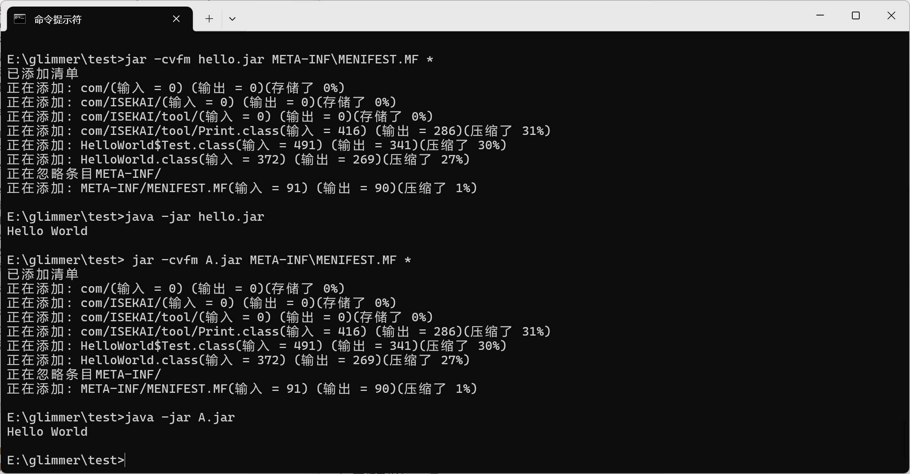
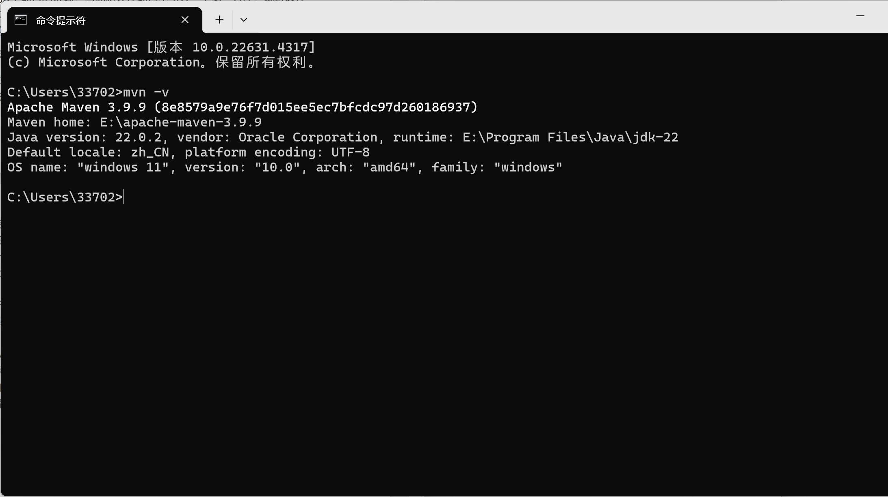
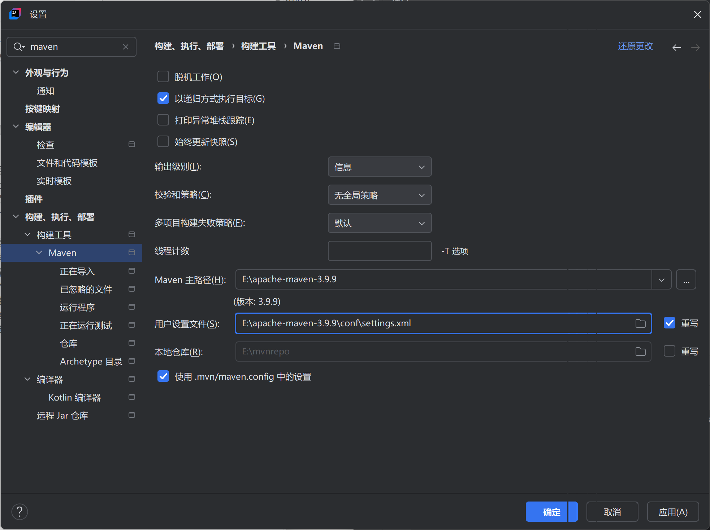
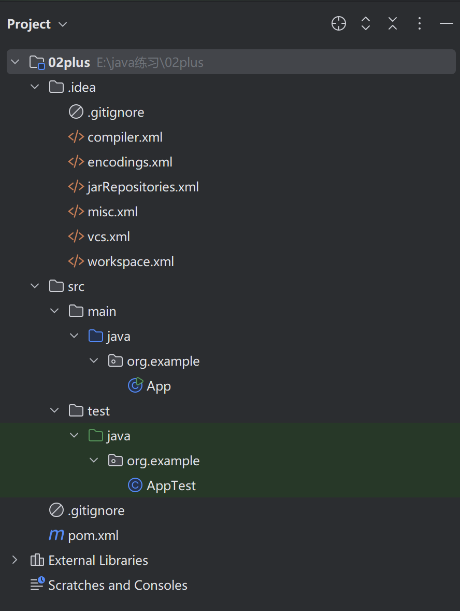
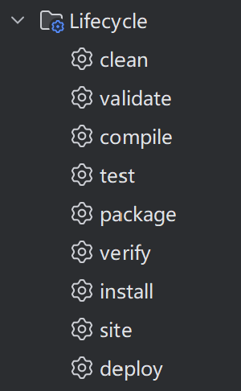
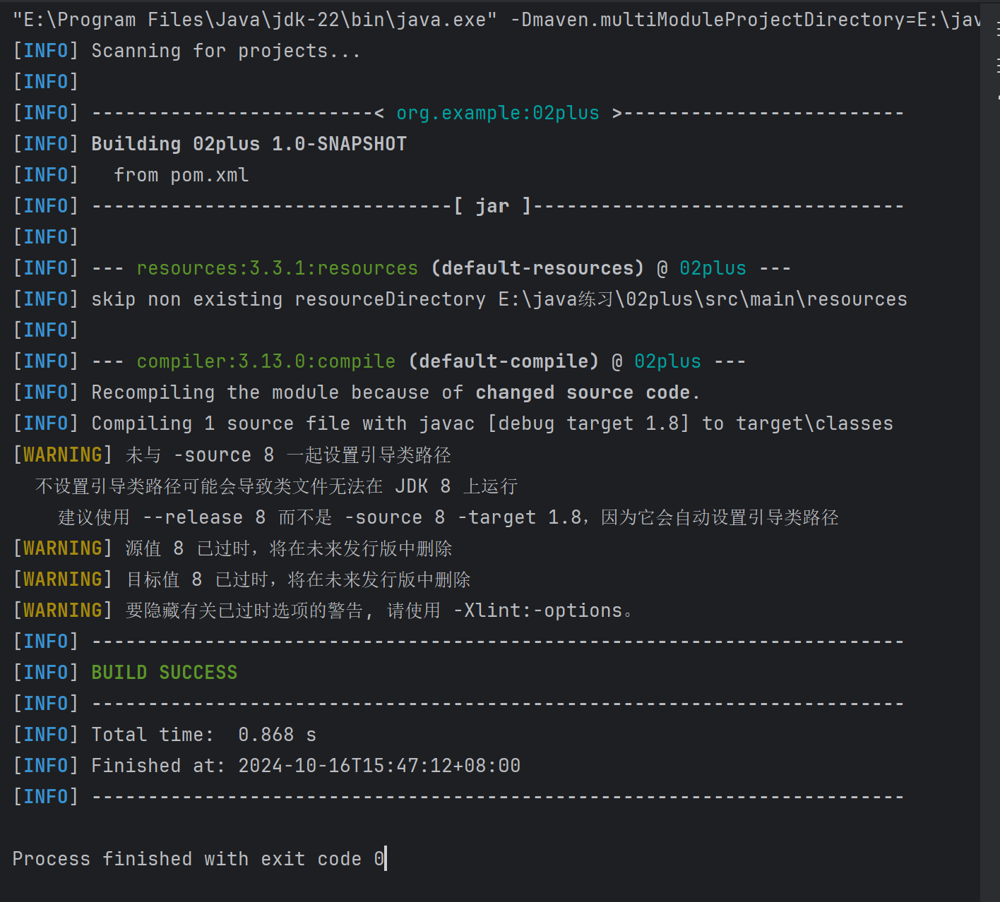

# JVM

## 4

1. classpath：类路径，属于java环境配置中要设置的一个环境变量，指示.class文件的路径，表示JVM要从哪里看、去寻找要运行的class文件
2. 如果JVM没找到这个字节码文件会发生什么：提示错误：找不到或无法加载类
3. classpath是一串目录，那么如果两个目录都有一个相同的字节码文 件，JVM的选择策略是什么：选择先被找到的那个

## 5

1. jar包：

   1. 是一种与平台无关的文件格式；
   2. 可以将多个文件合成一个文件，将多个java applet（程序片）及所需组件（包括类文件、图像、声音等）绑定到jar文件中；-即jar包包含很多类文件，相当于目录，classpath会经过jar包
   3. 可以将其作为单个的简单HTTP事务下载到浏览器中提高下载速度；
   4. 并且jar格式还支持压缩，进一步缩短下载时间；
   5. 以zip压缩格式为基础；
   6. 用于压缩、发布。部署和封装库、组件和插件程序
   7. 内含特殊的文件指示工具如何处理特定的jar

2. jar包中 的 /META-INF/MANIFEST.MF 文件是什么：

   是一个纯文本文件

3. 它是必需的吗

   不是，但是大部分jar文件都包含

4. 有什么作用

   用于指定Main-class和其它信息；JVM会自动读取它，可以不必在命令行指定启动的类名，而是用更方便的命令:

   `java -jar *jar包名*.jar`

   当jar包中包含其它jar包时，就需要在此文件中配置classpath

## 6



[A.jar](./A.jar)

## 7

1. 依赖范围：

   1. compile：编译、测试、运行
   2. test：测试
   3. provided：编译、测试
   4. runtime：运行

2. 可能带来的问题：

   jar包冲突：

   1. jar包之间版本不同

      即：包坐标相同但版本不同

      解决办法：按照最短路径引入jar；路径长度相同时在同一个xml文件中两个相同的依赖时取后声明的；在不同的xml中有取先声明的；还可以通过依赖排除解决冲突

   2. 按照最短路径机制读取到版本落后的jar包，但是在项目中用到更新版本jar包中的方法

      举例：

      - A->B->C->G21(guava 21.0)
      - E->F->G20(guava 20.0)

      调用G21的方法时可能抛出异常

# Maven

## 8



[maven](./settings.xml)

## 9



## 10



1. .idea:java配置文件
2. src：
   1. main：
      1. java：项目源代码
      2. 一个名为App的类
   2. test
      1. java：测试码
      2. 一个名为AppTest的测试用例
   3. .gitignore:被git忽视的文件目录
   4. pom.xml：项目核心配置文件，定义项目名称、模块名、依赖关系等
3. External Libraries：外部库
4. scratches and consoles：提供临时文件编辑环境

## 11



1. clean删除：删除目标目录中的编译输出文件，在构建之前执行，确保项目从一个干净的状态开始
2. validate验证：验证项目是否正确，所有必要信息是否可用
3. compile编译：编译项目的源代码
4. test测试；测试编译后的源代码
5. package打包：将编译后的代码打包，如打包成jar
6. verify验证：运行集成测试结果的检测
7. install安装：将包安装到本地仓库供本地其它项目使用
8. site：生成项目文档和站点信息
9. deploy部署：将包复制到远程仓库供其他开发人员使用



这部分我没有在网上搜到具体教程，下面是我自己的理解：

buiding……1.0snapshot:创建快照并打包

resources：3.3.1：resources：表示一个明确的插件目标，用于处理和复制资源文件

没有扫描到资源仓库

compile：……：运行编译插件，将源代码编译

一些提醒

成功构建项目

返回构建用时和成功构建时间

返回0，正常退出

## 12

```
<project xmlns="http://maven.apache.org/POM/4.0.0" xmlns:xsi="http://www.w3.org/2001/XMLSchema-instance"
  xsi:schemaLocation="http://maven.apache.org/POM/4.0.0 http://maven.apache.org/xsd/maven-4.0.0.xsd">
  <modelVersion>4.0.0</modelVersion>：指定此文件使用的XML schema版本

  <groupId>org.example</groupId>：项目的组名，通常为反转的域名
  <artifactId>02plus</artifactId>：项目的标识符，通常为项目名称
  <version>1.0-SNAPSHOT</version>：项目版本号
  <packaging>jar</packaging>：项目的打包方式，此处为默认值jar

  <name>02plus</name>：项目名
  <url>http://maven.apache.org</url>：项目主页，提供项目的网址

  <properties>：人为设置的属性或者说宏，定义和管理项目中所需要的属性，提高代码的维护性和可读性
    <project.build.sourceEncoding>UTF-8</project.build.sourceEncoding>
  </properties>

  <dependencies>：项目的依赖列表
    <dependency>：指定某一个依赖项
      <groupId>junit</groupId>：指定依赖项的groupId，项目的组名
      <artifactId>junit</artifactId>：指定依赖项的artifactId，项目的标识符
      <version>3.8.1</version>：指定依赖项版本号
      <scope>test</scope>：指定依赖项在项目中的使用范围，此处是test，只能进行测试，还可设置为compile（默认）、provided、runtime
    </dependency>
  </dependencies>
</project>
```


# 参考资料

[「JAVA」 Java基础之CLASSPATH环境变量 - 知乎 (zhihu.com)](https://zhuanlan.zhihu.com/p/126323702)

[Java包管理的那些事2——神奇字节码在哪里 - 知乎 (zhihu.com)](https://zhuanlan.zhihu.com/p/57869026)

[jar包是什么？-CSDN博客](https://blog.csdn.net/qq_26591517/article/details/80538385)

[Java中令人困惑的classpath和jar到底是什么鬼?_classpath file和jar manifest区别-CSDN博客](https://blog.csdn.net/m0_53157173/article/details/123312098)

[JAVA-如何打包成jar包_java打包成jar包-CSDN博客](https://blog.csdn.net/littleflower9/article/details/121036703)

[java打jar包的几种方式详解 - jack_Meng - 博客园 (cnblogs.com)](https://www.cnblogs.com/mq0036/p/8566427.html)

[Maven中jar的依赖关系详解_maven中jar包的依赖关系-CSDN博客](https://blog.csdn.net/qq_43434831/article/details/95792448)

[什么是groupid和artifactId？-CSDN博客](https://blog.csdn.net/qq_18975791/article/details/104175134)

[为什么会产生jar包冲突，如何排查jar包冲突？ - 上帝爱吃苹果-Soochow - 博客园 (cnblogs.com)](https://www.cnblogs.com/keeya/p/12093640.html#:~:text=1 Jar包冲突产生的原因 我们知道maven有传递性依赖机制，举例来说，当我们需要A的依赖的时候，就会在pom.xml中引入A的jar包；而A的jar包中依赖了B的jar包，这样Maven在解析pom.xml的时候，会依次将A、B 的jar包全部都引入进来。 这样就会造成一个问题： A->B->C->G21 (guava 21.0),打开pom.xml ... 3 避免Jar包冲突 最重要的还是要主动避免jar包冲突的情况，在父pom文件中利用 ，对依赖Jar包进行统一版本管理，一劳永逸。 通常的做法是，在parent模块的pom文件中尽可能地声明所有相关依赖Jar包的版本，并在子pom中简单引用该构件即可。 )

[maven的下载与安装教程（超详细）_maven安装-CSDN博客](https://blog.csdn.net/u012660464/article/details/114113349)

[基于maven的Java项目目录结构 - 知乎 (zhihu.com)](https://zhuanlan.zhihu.com/p/98456775)

[Maven 构建生命周期 | 菜鸟教程 (runoob.com)](https://www.runoob.com/maven/maven-build-life-cycle.html)

[全面详解Maven的配置文件pom.xml（含常用plugin）_maven pom.xml-CSDN博客](https://blog.csdn.net/qq_20236937/article/details/135893883)