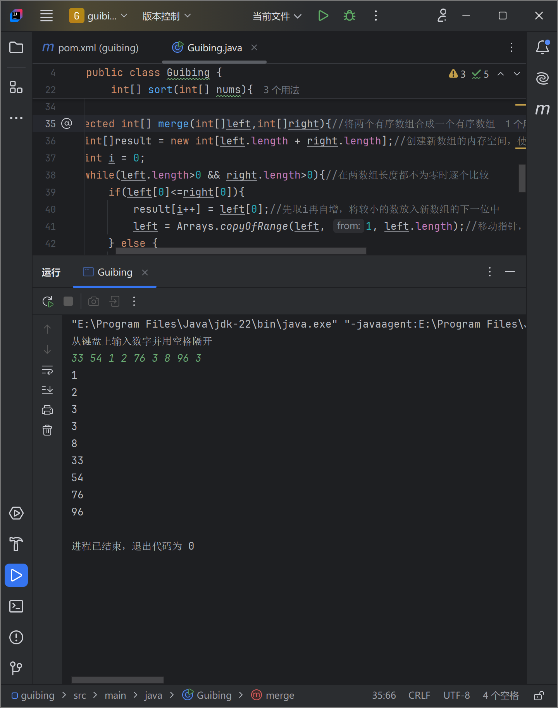

归并排序：

1. 将原数组不断划分为子数组，直到每个数组内只含有一个元素，成为有序表

2. 申请空间，大小为两个序列之和
3. 设定两个指针，初始位置为两个序列的起始位置
4. 比较两个指针指向的元素，相对小的元素放入新的空间，移动指针到下一位置
5. 某一指针到达序列尾
6. 将另一序列剩下的所有元素复制到合并序列尾

代码思路见注释内容

[code](./guibing.zip)

参考资料：

[1.5 归并排序 | 菜鸟教程 (runoob.com)](https://www.runoob.com/w3cnote/merge-sort.html)

[排序——归并排序（Merge sort）-CSDN博客](https://blog.csdn.net/justidle/article/details/104203958)

[11.6  归并排序 - Hello 算法 (hello-algo.com)](https://www.hello-algo.com/chapter_sorting/merge_sort/#1161)

[Java split() 方法 | 菜鸟教程 (runoob.com)](https://www.runoob.com/java/java-string-split.html)