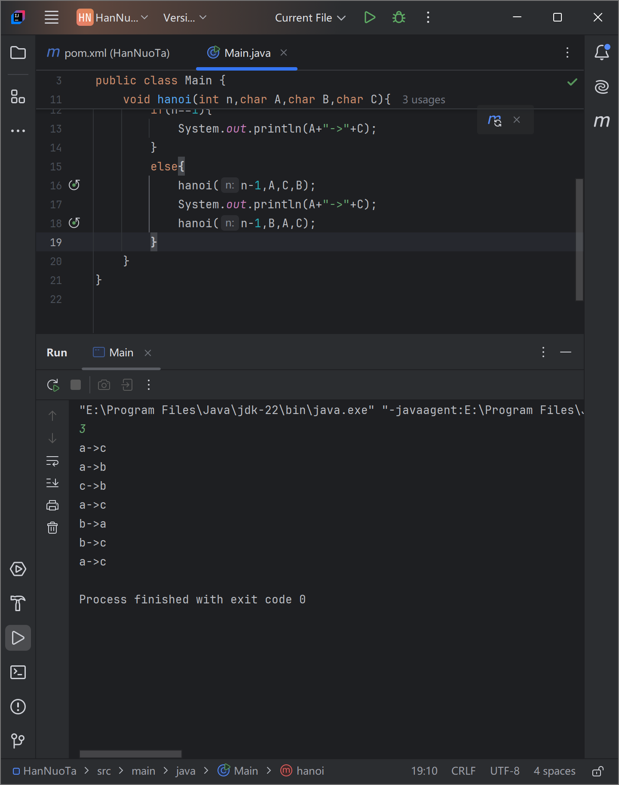

n=1,只需将a移到c

n=2，1：a-b，2:a-c，3：b-c

n=3，先实现将两块移到b，再将最大块移到c，最后将两块由b移至c

可知，先实现将n-1块移到b，再将最大块移到c，最后将n-1块由b移到c

要将n-1块移到b，先将n-2块移到c

代码：

先用nextint方法读取控制台传入的整数

当传入1 时只需将铁片从a移至c

当传入n时先实现把n-1个从a移到b，在移动a到b的过程中，b相当于c，c相当于b

把最大片从a移到c

把n-1个从b移动到c，此时ab角色互换

a相当于起始，b相当于辅助，c相当于目标，三柱在运行过程中角色有规律地互换

运行成功截图：

成功代码

[code](./Hanoi.zip)