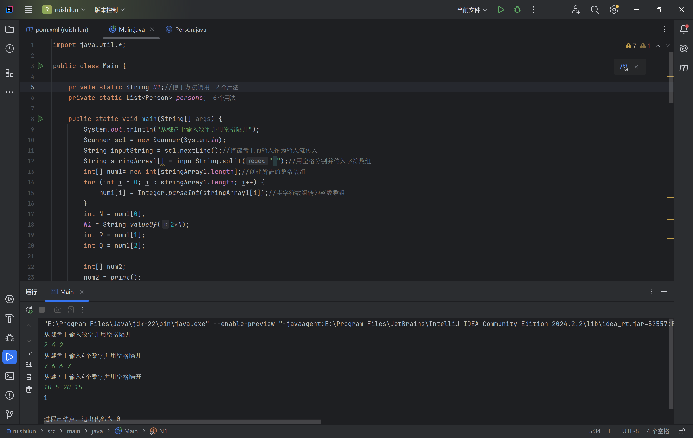

[code](./ruishilun.zip)

代码详细思路见注释

参考资料:

[怎么理解、重写Java的Arrays.sort()的比较器Comparator的compare()方法，自定义排序规则_java重写比较算法-CSDN博客](https://blog.csdn.net/GsxxInCsdn/article/details/122147184)

[Java中Arrays.sort()的三种常用用法（自定义排序规则）_arrays.sort自定义排序-CSDN博客](https://blog.csdn.net/ssjdoudou/article/details/107886461)

[Java Arrays.Sort方法重写_重写arrays.sort-CSDN博客](https://blog.csdn.net/sinat_38079265/article/details/123200923)

[Java实战入门：深入解析Java中的 `Arrays.sort()` 方法-腾讯云开发者社区-腾讯云 (tencent.com)](https://cloud.tencent.com/developer/article/2423738)

[Java list修改某个元素值的方法_java list修改某一个元素的值-CSDN博客](https://blog.csdn.net/Maybe221/article/details/118702823)